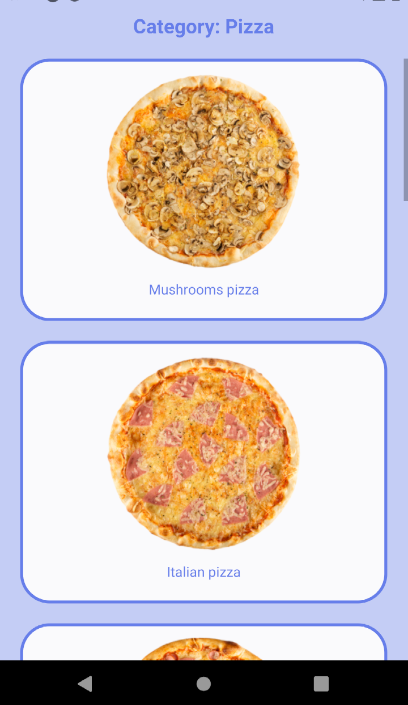

# Second exercise for Hybrid mobile Applications module

&nbsp;

    

&nbsp;

### Requirements:

Healthy Food Recipes. Possibility to choose recipes according to certain categories (soups, desserts, etc.). All recipe data is stored in JSON format. Each recipe category is stored in different program windows (NAVIGATOR). There must be a way to leave a comment below the recipe. Comments are stored with APIs AsyncStorage.

- Use Navigator to navigate between different program windows.
- Create object array for save data about recipes.
- Create insert comments function.
- Create get comments function.
- Create delete comment function.

 

### Demo:
 

    

